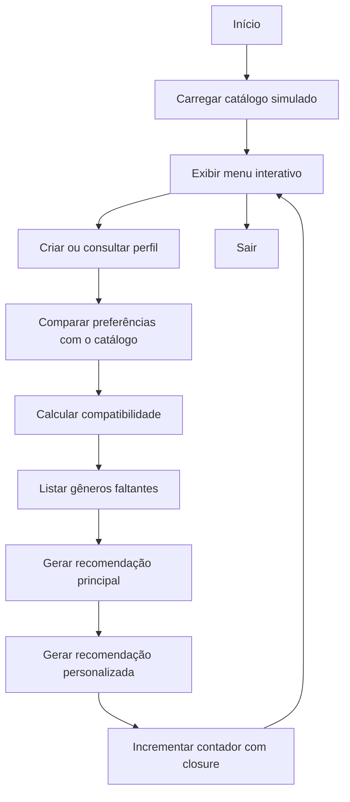
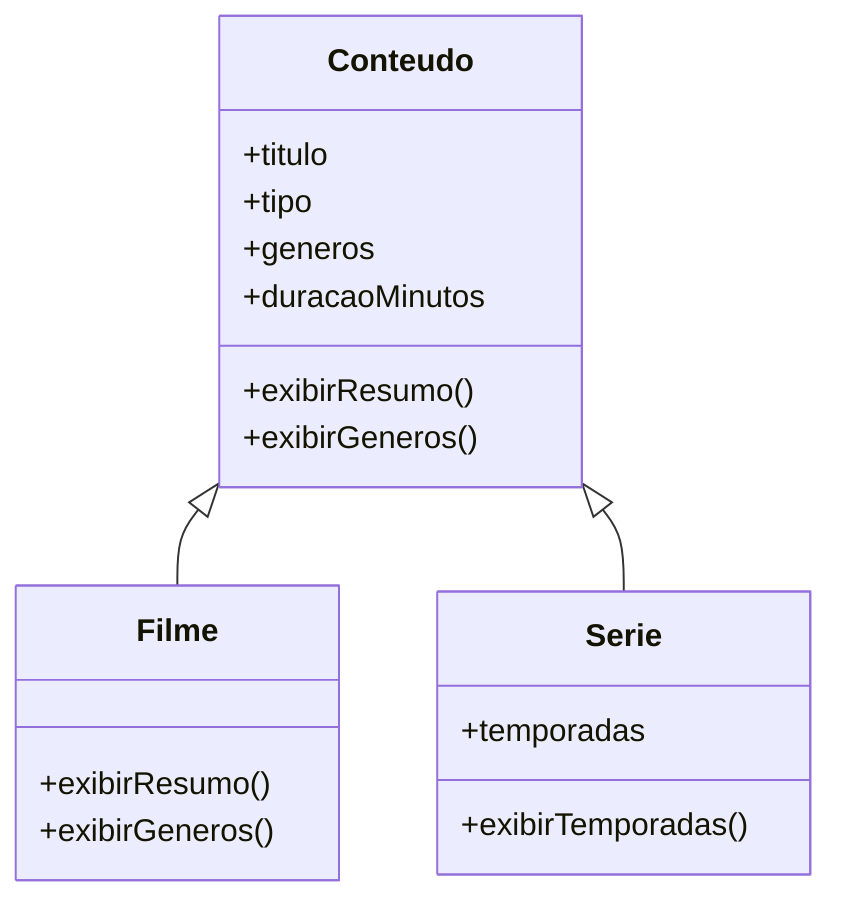
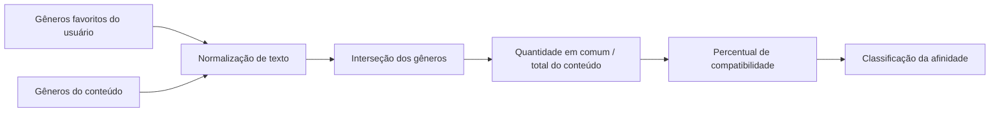
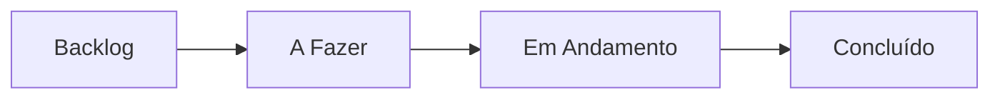
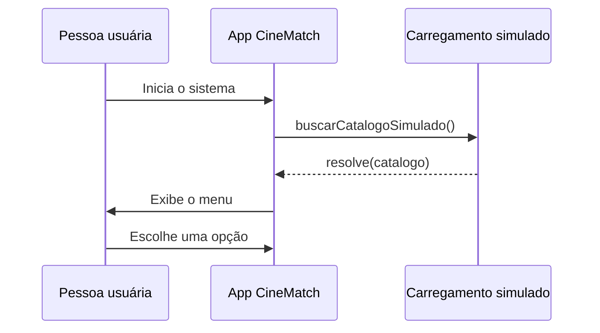

# CineMatch JS


## Sobre o projeto

O **CineMatch JS** é um simulador interativo de recomendação de streaming criado em **Node.js** para o mini-projeto avaliativo da disciplina **Mobile React Native T1 - M1S6**.

A aplicação conversa com a pessoa usuária pelo terminal, coleta perfil, compara preferências com um catálogo inicial de filmes fictícios e gera recomendações com base em compatibilidade, gêneros não explorados e sugestões personalizadas. Pelo menu, também é possível adicionar filmes, séries ou outros tipos de conteúdo.

O projeto foi estruturado para demonstrar, na prática, os principais conceitos trabalhados no módulo:

- lógica de programação;
- entrada interativa via terminal;
- arrays e métodos de array;
- objetos e classes;
- herança;
- uso de `this`;
- callbacks;
- closures;
- Promises e `async/await`;
- menu interativo com repetição;
- organização e documentação técnica.

## Demonstração do fluxo



## Estrutura orientada a objetos



## Organização do projeto

```txt
Mini-Projeto-PlayNow-LTD/
├── cinematch.js
├── class.js
├── catalogo.js
├── cspell.json
├── package.json
└── README.md
```

## O que o sistema faz

| Recurso                    | Descrição                                                            |
| -------------------------- | -------------------------------------------------------------------- |
| Perfil interativo          | Pergunta nome, idade e gêneros favoritos via terminal                |
| Catálogo fictício          | Mantém filmes com gêneros, duração e identificador                   |
| Compatibilidade            | Calcula a porcentagem de aderência entre usuário e conteúdo          |
| Classificação              | Exibe alta, média ou baixa afinidade                                 |
| Gêneros faltantes          | Mostra o que a pessoa ainda não explorou em cada conteúdo            |
| Recomendação principal     | Exibe o primeiro conteúdo com compatibilidade total (100%)           |
| Recomendação personalizada | Sugere o próximo gênero a testar com base no perfil                  |
| Catálogo simulado          | Usa `Promise` e `async/await` para simular carregamento de streaming |
| Contador com closure       | Mantém o total de recomendações exibidas no menu                     |

## Menu atual

| Opção | Ação                                            |
| ----- | ----------------------------------------------- |
| 0     | Criar meu perfil                                |
| 1     | Ver meu perfil                                  |
| 2     | Ver catálogo completo                           |
| 3     | Adicionar conteúdo ao catálogo                  |
| 4     | Calcular compatibilidade com todos os conteúdos |
| 5     | Ver o conteúdo mais recomendado                 |
| 6     | Ver gêneros faltantes por conteúdo              |
| 7     | Recomendação personalizada                      |
| 8     | Excluir meu perfil                              |
| 9     | Carregar catálogo simulado                      |
| 10    | Sair                                            |

## Como o cálculo funciona



## Requisitos atendidos

| RF   | Requisito                        | Implementação no projeto                                             |
| ---- | -------------------------------- | -------------------------------------------------------------------- |
| RF01 | Criar perfil via terminal        | `criarPerfil()` com `prompt-sync`                                    |
| RF02 | Criar catálogo de conteúdos      | `catalogo.js` com objetos fictícios                                  |
| RF03 | Calcular compatibilidade         | Função `compatibilidade()`                                           |
| RF04 | Classificar compatibilidade      | `if/else` em `compatibilidade()`                                     |
| RF05 | Listar habilidades faltantes     | `listarGenerosFaltantes()`                                           |
| RF06 | Encontrar maior compatibilidade  | Pendente: a função ainda busca apenas compatibilidade de 100%        |
| RF07 | Gerar recomendação personalizada | `recomendarProximoGenero()`                                          |
| RF08 | Usar métodos de array            | `map`, `filter` e `find` no fluxo de compatibilidade e recomendações |
| RF09 | Criar classe                     | `Conteudo` em `class.js`                                             |
| RF10 | Usar herança                     | `Serie extends Conteudo` e `Filme extends Conteudo`                  |
| RF11 | Demonstrar uso do `this`         | `exibirResumo()` e `exibirGeneros()`                                 |
| RF12 | Usar callback                    | `saudacaoDespedida(usuario, despedida)`                              |
| RF13 | Usar closure                     | `criarContadorDeRecomendacoes()`                                     |
| RF14 | Usar Promise e async/await       | `buscarCatalogoSimulado()` e `iniciarSistema()`                      |
| RF15 | Criar menu interativo            | `menu()` com `do...while` e `switch`                                 |

## Como executar

### Pré-requisitos

- Node.js instalado
- npm disponível no terminal

### Instalação

```bash
npm install
```

### Execução

No Windows, se o terminal apresentar problemas com acentuação, execute antes:

```bash
chcp 65001
```

Depois rode o projeto:

```bash
node cinematch.js
```

## Dependências

| Pacote        | Função                                            |
| ------------- | ------------------------------------------------- |
| `prompt-sync` | Capturar entradas da pessoa usuária pelo terminal |

## Ferramentas e organização

| Item         | Uso no projeto                                         |
| ------------ | ------------------------------------------------------ |
| VS Code      | Editor do código                                       |
| Git / GitHub | Versionamento e publicação do repositório              |
| Kanban       | Organização das tarefas do mini-projeto                |
| cspell.json  | Dicionário de termos em pt-BR e vocabulário do projeto |

### Extensões recomendadas para o VS Code

- **ESLint**: destaca problemas comuns de JavaScript, como variáveis sem declaração.
- **Prettier - Code formatter**: mantém a formatação do código consistente.
- **Code Spell Checker**: usa o arquivo `cspell.json` para revisar a escrita em português e inglês.

## Internet e arquitetura cliente-servidor

Na internet, aplicações cliente enviam requisições a servidores pela rede; os servidores processam a solicitação e devolvem uma resposta. Em uma plataforma de streaming real, o aplicativo cliente pediria o catálogo a uma API e receberia os conteúdos para exibição.

Neste projeto, o terminal representa o **cliente** e `buscarCatalogoSimulado()` representa o **servidor**. A função usa `Promise` e `setTimeout` para simular o tempo de resposta de uma busca remota, mas os dados continuam locais em `catalogo.js`: nenhuma API ou conexão de rede é utilizada.

### Declaração de variáveis

O código prioriza `const` para valores que não são reatribuídos e `let` para valores que mudam durante o fluxo. `var` tem escopo de função e permite redeclarações; por isso, não é adotado neste projeto, em favor de `let` e `const`, que tornam o escopo mais previsível.

## Kanban do projeto

Quadro utilizado para acompanhar o desenvolvimento do mini-projeto no Trello.

| Item          | Link                                                     |
| ------------- | -------------------------------------------------------- |
| Quadro Kanban | <https://trello.com/b/N6BxvB8m/mini-projeto-playnow-ltd> |

### Colunas do quadro



## Como o carregamento simulado funciona

O catálogo não é carregado de uma API real. O projeto simula um servidor de streaming usando `Promise` + `setTimeout`, e o menu permite repetir essa etapa pela opção **9**.



## Funcionalidades em destaque

- Coleta interativa de perfil no terminal.
- Catálogo com filmes organizados em objetos e classes.
- Compatibilidade percentual com classificação automática.
- Gêneros faltantes por conteúdo.
- Recomendação principal e recomendação personalizada.
- Contador de recomendações com closure.
- Carregamento simulado do catálogo com Promise e `async/await`.
- Menu interativo em loop até a pessoa usuária sair.

## Observações para a entrega

- O projeto foi feito para a avaliação da Semana 06.
- A proposta é demonstrar domínio progressivo dos conceitos vistos em aula.
- O repositório deve permanecer público, com histórico de commits e quadro Kanban atualizado.
- O vídeo de apresentação deve mostrar a execução no terminal e explicar a organização do projeto.

## Vídeo de apresentação

| Item                  | Status                                                                                                         |
| --------------------- | -------------------------------------------------------------------------------------------------------------- |
| Vídeo de apresentação | [Assistir no Google Drive](https://drive.google.com/file/d/1fld6BDsPJDkq8lwuLIYfblrvI7bzBU68/view?usp=sharing) |

### Roteiro sugerido para a gravação

Planeje a gravação para **5 minutos**. Os tempos abaixo totalizam **5:00** e deixam a maior parte do vídeo para a demonstração do programa.

| Tempo     | Duração    | O que apresentar                                                                                                                  |
| --------- | ---------- | --------------------------------------------------------------------------------------------------------------------------------- |
| 0:00–0:30 | 30 s       | Apresentar o objetivo do projeto e o problema que ele resolve.                                                                    |
| 0:30–1:05 | 35 s       | Mostrar o arquivo principal e resumir o fluxo: perfil, catálogo, compatibilidade e recomendações.                                 |
| 1:05–2:00 | 55 s       | Executar o projeto no terminal e demonstrar a criação do perfil.                                                                  |
| 2:00–2:35 | 35 s       | Mostrar o carregamento simulado do catálogo com `Promise` e `async/await`.                                                        |
| 2:35–3:45 | 1 min 10 s | Navegar pelas opções do menu, destacando compatibilidade, gêneros faltantes, recomendação principal e recomendação personalizada. |
| 3:45–4:30 | 45 s       | Explicar onde estão classes, herança, callback, closure e métodos de array.                                                       |
| 4:30–5:00 | 30 s       | Finalizar mostrando a organização do Kanban, as branches e os commits realizados.                                                 |

Faça um ensaio cronometrado antes de gravar. Se algum comando demorar para responder, reduza a explicação do código e priorize a demonstração no terminal.

## Licença

Projeto acadêmico para fins de avaliação e portfólio.
